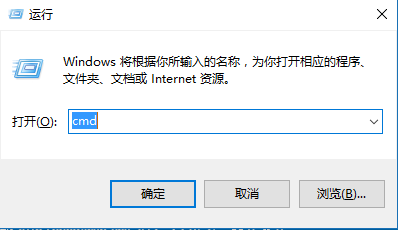
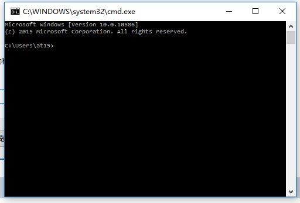
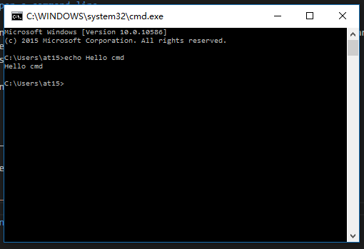

# Command line

aka: terminal, console, cli, cmd, bash etc.

## What is command line

You type and run commands in plain text, and get text output. NO GUI (Graphic User Interface) interaction.

tl;dw

## How to 

### Open a command line

- `win + R` ( this means you press the windows icon on your keyboard, and press the `R` leter at same time. )
- type `cmd`
- press `enter`

- you can see a black window

- type something like `echo Hello cmd`

- list folders `dir`

## Concepts

### Executeable

- binary TODO: vagrant, a c example. (windows: exe, linux: executeable)
- script TODO: a bat example, a python example.

### Arguments

- a php example

### Current folder

### PATH

- windows config
- linux config

how to use it.

### Environment variables

- windows config
- linux config

### Autocomplete

use tab