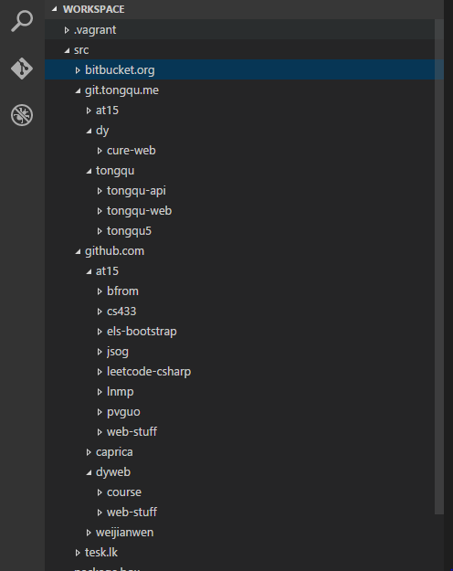

# Workspace Setup

How to orgnaize all your projects

## Where is the problem

**tl;dr**

- version control and sync
- name collision, ie: fork
- too many projects, ie: [gaocegege](https://github.com/gaocegege)

### The long story 

(This is not real)

#### Version Control and Sync

Jack is working on his homework, he want to try a new algorithm, so he copied a new folder.

````
D:/Code/
    -- homework
    -- homework-2
````

And Jack asked Mike to check his code, he send the code via email(QQ), and put Mike's modification in a new folder.

````
D:/Code/
    -- homework
    -- homework-2
    -- homework-3
    .....
````

And he got 10 homework and 4 labs for this course, boom! (No picture no BB)


Jack got a laptop and a PC, he have to copy all the code in flash disk in order to sync, and sometimes he forgot it.
Jack want to go back to his old code, he want to add tag for certain code, like `fix-memory-leak`, also he needs to work with Mike.

That's why `Git`, `GitHub` shows up.

Git is a version control system, and GitHub is the most popular Git repository host, free for opensource projects. 

#### Name collision

Jack forked a project, [gaocegege's scrala](https://github.com/gaocegege/scrala)

````
D:/Code/
   -- scrala
````

But he wants to have a local copy for the original repo, so he have to rename it.

````
D:/Code/
   -- scrala
   -- gaocegege-scrala
````

He wrote a scarala that can only be for his lab project

````
D:/Code/
   -- scrala
   -- gaocegege-scrala
   -- lab-scrala
````

He is tired of renaming the repo.

#### Too many projects

Jack got  homework, lab, outsource, opensource, for gf, for goddess's bf etc. 

## Solution

**tl;dr**

- use git
- tree
- [the Go way](https://golang.org/doc/code.html)

### Put your folders in a tree

You have many source for your projects, homework, lab, outsource, opensource, for gf, for goddess's bf etc. You can have workspace like the following

````
D:/Code/
   -- homework
      -- 2016-Spring
         -- environment
   -- lab
      -- cit
         -- distributed-monitoring
      -- cat
         -- wangwangwang
   -- eclipse
      -- che
      -- flux
      -- che       
   -- good-man
       -- ex
          -- python-final
       -- goodess-bf-1
       -- goodess-ex-bf          
          -- master-thesis
````

### Organize by Git host

This is [the Go way](https://golang.org/doc/code.html) , if you have a parent directory for `bin`. 

Since it's a goode idea to have all your code in sync, you may have multiple Git host, GitHub for public repos, GitLab for internal projects

````
D:/Code/
   -- github.com
      -- at15
         -- crawler
         -- how-to-play-tennis
      -- gaocegege
         -- scrala
         -- how-to-dig-holes
   -- git.tongqu.me
      -- tongqu
         -- tongqu5
         -- tongqu-api
         -- tongqu-web
````

the workspace for at15



## Ref

- [Git](https://git-scm.com/)
- [GitHub](https://github.com)