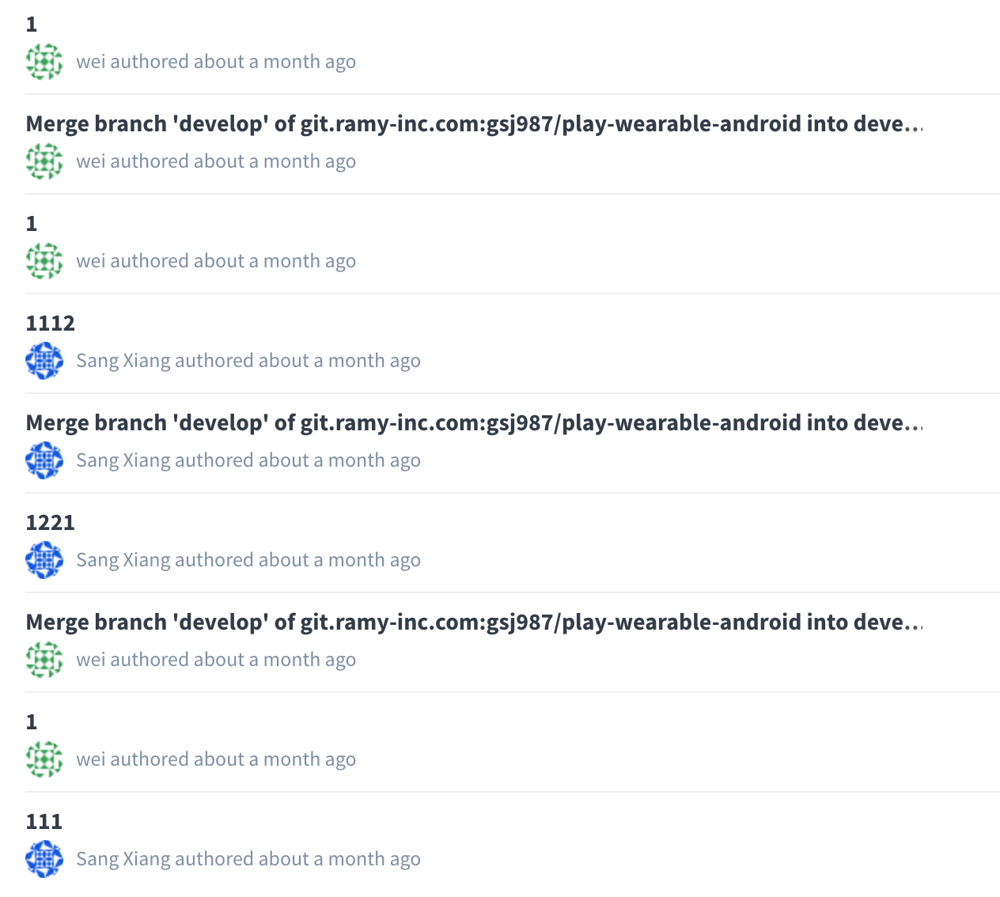

# Git Teamwork

## Commit message

Why we should write good commit messages?

- To speed up the reviewing process.
- To help us write a good release note.
- To help the future maintainers.

How to write good commit messages?

Cause we are all students, I don't think we should obey lots of rules of writing commit messages. If your messages can satisfy the following three points, I think it's ok.

- Write the accuracy first word in your message subject. Like fix, enhance, doc, style, bug ...
- Don't take your subjective emotion. Like fuck, wo cao, !!! ...
- Make the messages clear. Know the meaning of your own message at least...

## Comparison of two different teamwork

**Every commit messages will be your possible black history ~ **

## Maintain multiple branches

If you only have one branches, you may meet some problems.

- Boss: The clients say the product should add xxx function! You should add it before tomorrow!
- *You add the function in you only branch hardly, you forget other programmer change some architecture yesterday. Finally, you build a incomplete version and hand out the clients*
- It's a stupid tragedy.

So, you should always maintain multiple branches in your work, especially in teamwork.

Popularly, we always maintain two different types of branches.

- Main branches
    - master
    - stable

- Support branches
    - feature
    - bug
    - hotfix

## Reference

- [A commit message guid by Ruan Yifeng](http://www.ruanyifeng.com/blog/2016/01/commit_message_change_log.html)

- [Git/GitHub branching standards & conventions](https://gist.github.com/digitaljhelms/4287848)

